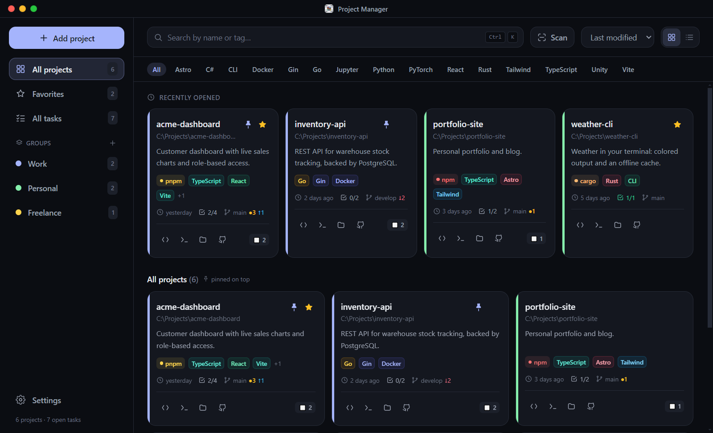
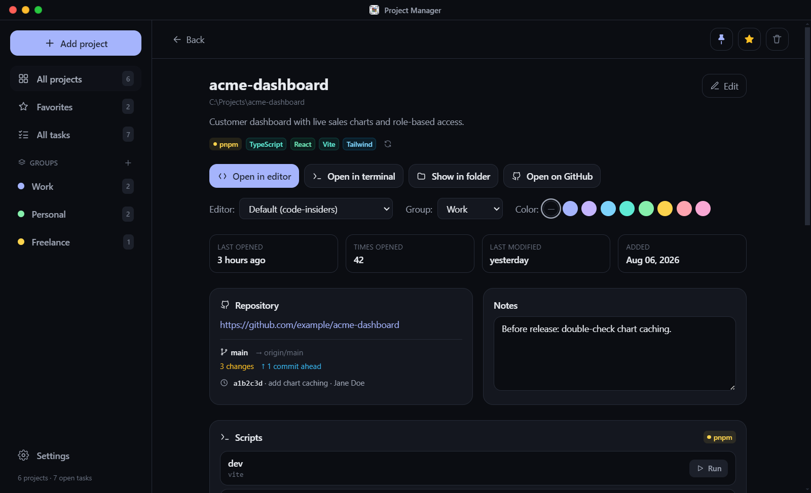
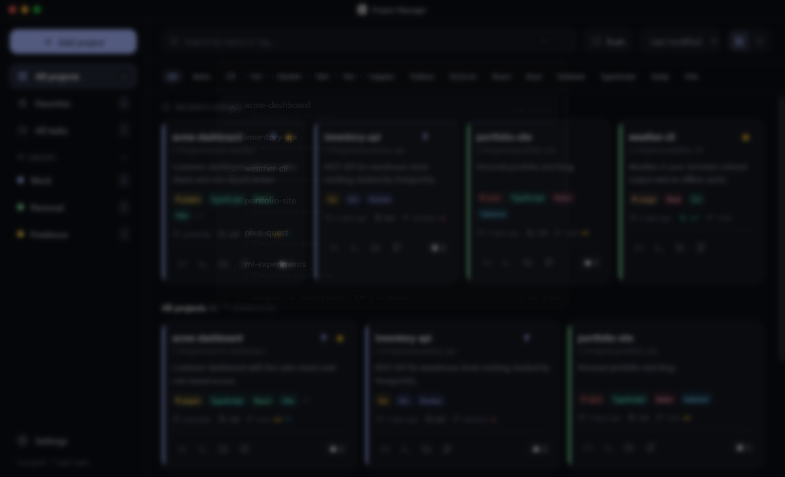

<div align="center">


# Project Manager

**A keyboard-first desktop hub for your local projects.**
Find any project in a keystroke, open it in your editor, and see its git status and tasks at a glance.

[Download](../../releases/latest) · [Türkçe](README.tr.md)



</div>

## Features

- **Command palette** (<kbd>Ctrl</kbd>+<kbd>K</kbd>): fuzzy-search your projects and press <kbd>Enter</kbd> to open one in your editor. A global shortcut (<kbd>Ctrl</kbd>+<kbd>Shift</kbd>+<kbd>P</kbd>) opens it even while the app sits in the tray.
- **Add projects your way**: pick a folder, drop one onto the window, or scan a root folder and import everything it finds.
- **Automatic detection** of ~40 languages, frameworks (React, Next.js, Django, Laravel, Rails, Spring, Flutter, Unity, Godot…) and package managers (npm, pnpm, yarn, bun, cargo, pip, poetry, go, composer, nuget…).
- **Git status on every card**: current branch, uncommitted changes, commits ahead/behind.
- **Quick actions**: open in your editor (per-project choice: VS Code, VS Code Insiders, Cursor, or any command), in a terminal, in Explorer, or on GitHub.
- **Project pages** with notes, a to-do list, the rendered README and one-click `package.json` scripts.
- **All tasks**: every project's to-dos in one list.
- **Organize**: favorites, pinning, color-coded groups (drag cards onto a group), tags and sorting.
- **Tray menu** with favorites and recent projects; open one without opening the window.
- **Maintenance**: spots projects whose folder was moved or deleted, re-detects tags, exports and imports backups.
- **Turkish and English** UI, dark and light themes, eight accent colors.

<table>
  <tr>
    <td></td>
    <td></td>
  </tr>
</table>

## Install

Download the latest `proje-yoneticisi-setup-<version>.exe` from [Releases](../../releases/latest) and run it. Windows 10 and 11 are supported.

The installer is not code-signed yet, so Windows SmartScreen will warn about an unknown publisher. Choose **More info → Run anyway**.

To update, install the new version over the old one. Your projects are kept: the app stores its data outside the install folder (see [Your data](#your-data)).

## Keyboard shortcuts

| Shortcut | Action |
| --- | --- |
| <kbd>Ctrl</kbd>+<kbd>K</kbd> | Command palette |
| <kbd>Enter</kbd> / <kbd>Ctrl</kbd>+<kbd>Enter</kbd> (in the palette) | Open in editor / open the project page |
| <kbd>Ctrl</kbd>+<kbd>Shift</kbd>+<kbd>P</kbd> | Bring the app up with the palette open (works from the tray; configurable) |
| <kbd>Ctrl</kbd>+<kbd>N</kbd> | Add a project |
| <kbd>Ctrl</kbd>+<kbd>F</kbd> | Search |
| Arrow keys, <kbd>Enter</kbd> | Move between cards, open one |
| <kbd>Esc</kbd> | Back / close |

## Your data

Everything stays on your computer, in a single JSON file:

```
%APPDATA%\project-manager\data.json
```

A `.bak` copy of the previous version is written before every save, and the app recovers from it if the file is ever damaged. **Settings → Backup** exports and imports the whole thing.

The app makes no network requests of its own. The only things that reach the internet are links you open in your browser and `https` images embedded in a project's README.

## Development

Requirements: Node.js 22+ and npm, on Windows.

```bash
npm install
npm run dev         # the Electron app with hot reload
npm run dev:web     # the UI alone in a browser, on fictional sample data
npm run build       # installer in release/
```

| Path | What lives there |
| --- | --- |
| `src/main/` | Electron main process: window, tray, IPC, data file, git, project detection (`detect.js`) |
| `src/preload/` | The bridge the UI is allowed to use (`window.api`) |
| `src/renderer/src/` | React UI; `locales/` holds the translations |
| `scripts/` | Icon generation and the README screenshots |

**Adding a language**: copy `src/renderer/src/locales/en.js`, translate the values, and register the file in `src/renderer/src/lib/i18n.js`.

**Screenshots**: run `npm run dev:web` and then `npm run screenshots`. They are rendered from the fictional sample data in `src/renderer/src/lib/mockApi.js`.

If `npm run build` fails while extracting `winCodeSign` with a "cannot create symbolic link" error, turn on Windows Developer Mode (or run the terminal as administrator) and try again. Release builds on GitHub Actions don't hit this.

### Releasing

Pushing a version tag builds the installer on GitHub Actions and attaches it to a GitHub release:

```bash
npm version minor      # or patch / major: bumps package.json and creates the tag
git push --follow-tags
```

## License

[MIT](LICENSE)
