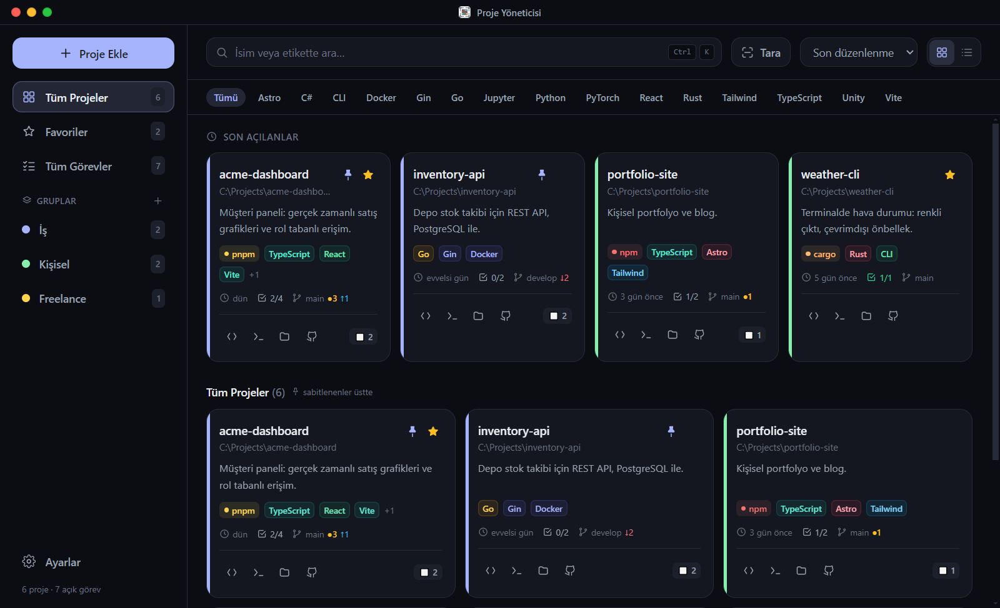
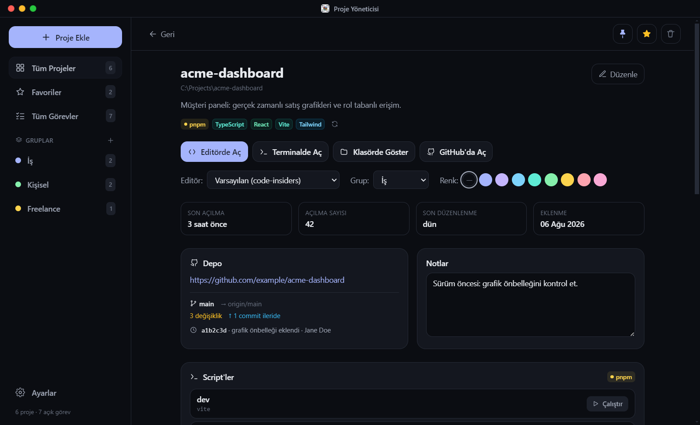
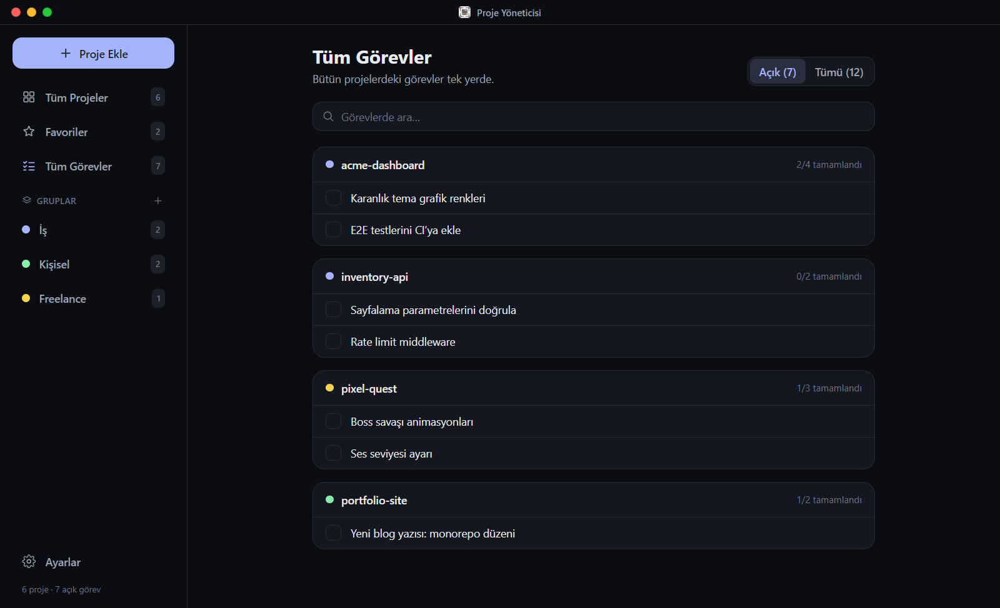

<div align="center">


# Proje Yöneticisi

**Yerel projelerin için klavye odaklı bir masaüstü merkezi.**
Herhangi bir projeyi tek tuşla bul, editöründe aç; git durumunu ve görevlerini bir bakışta gör.

[İndir](../../releases/latest) · [English](README.md)



</div>

## Özellikler

- **Komut paleti** (<kbd>Ctrl</kbd>+<kbd>K</kbd>): Projelerini bulanık aramayla bul, <kbd>Enter</kbd>'a basınca editöründe açılsın. Genel kısayol (<kbd>Ctrl</kbd>+<kbd>Shift</kbd>+<kbd>P</kbd>) uygulama tepsideyken bile paleti açar.
- **İstediğin gibi proje ekle**: Klasör seç, pencereye sürükle bırak ya da bir kök klasörü tarayıp bulunan her şeyi tek seferde içe aktar.
- **Otomatik algılama**: ~40 dil, framework'ler (React, Next.js, Django, Laravel, Rails, Spring, Flutter, Unity, Godot…) ve paket yöneticileri (npm, pnpm, yarn, bun, cargo, pip, poetry, go, composer, nuget…).
- **Her kartta git durumu**: Aktif dal, commit'lenmemiş değişiklikler, uzak dala göre ileride/geride olma.
- **Hızlı aksiyonlar**: Editörde (proje bazında seçilebilir: VS Code, VS Code Insiders, Cursor ya da herhangi bir komut), terminalde, Dosya Gezgini'nde ya da GitHub'da aç.
- **Proje sayfası**: Notlar, yapılacaklar listesi, işlenmiş README ve tek tıkla çalışan `package.json` script'leri.
- **Tüm Görevler**: Bütün projelerin görevleri tek listede.
- **Düzen**: Favoriler, sabitleme, renk kodlu gruplar (kartları gruba sürükle), etiketler ve sıralama.
- **Tepsi menüsü**: Favori ve son açılan projeler; pencereyi açmadan projeyi aç.
- **Bakım**: Taşınan ya da silinen proje klasörlerini fark eder, etiketleri yeniden algılar, yedeği dışa/içe aktarır.
- **Türkçe ve İngilizce** arayüz, karanlık ve aydınlık tema, sekiz vurgu rengi.

<table>
  <tr>
    <td></td>
    <td></td>
  </tr>
</table>

## Kurulum

[Releases](../../releases/latest) sayfasından en güncel `proje-yoneticisi-setup-<sürüm>.exe` dosyasını indirip çalıştır. Windows 10 ve 11 desteklenir.

Kurulum dosyası henüz kod imzalı değil, bu yüzden Windows SmartScreen bilinmeyen yayımcı uyarısı verir. **Daha fazla bilgi → Yine de çalıştır**'ı seç.

Güncellemek için yeni sürümü eskisinin üzerine kur. Projelerin korunur, çünkü uygulama verilerini kurulum klasörünün dışında tutar (bkz. [Verilerin](#verilerin)).

## Klavye kısayolları

| Kısayol | Ne yapar |
| --- | --- |
| <kbd>Ctrl</kbd>+<kbd>K</kbd> | Komut paleti |
| <kbd>Enter</kbd> / <kbd>Ctrl</kbd>+<kbd>Enter</kbd> (palette) | Editörde aç / proje sayfasını aç |
| <kbd>Ctrl</kbd>+<kbd>Shift</kbd>+<kbd>P</kbd> | Uygulamayı paletle birlikte öne getirir (tepsiden de çalışır; değiştirilebilir) |
| <kbd>Ctrl</kbd>+<kbd>N</kbd> | Proje ekle |
| <kbd>Ctrl</kbd>+<kbd>F</kbd> | Ara |
| Ok tuşları, <kbd>Enter</kbd> | Kartlar arasında gez, aç |
| <kbd>Esc</kbd> | Geri / kapat |

## Verilerin

Her şey bilgisayarında, tek bir JSON dosyasında durur:

```
%APPDATA%\project-manager\data.json
```

Her kayıttan önce önceki halin `.bak` kopyası yazılır; dosya bir gün bozulursa uygulama kendini ondan kurtarır. **Ayarlar → Yedekleme** ile her şeyi dışa ya da içe aktarabilirsin.

Uygulama kendi başına hiçbir ağ isteği yapmaz. İnternete giden tek şey tarayıcıda açtığın bağlantılar ve bir projenin README'sine gömülü `https` görselleridir.

## Geliştirme

Gerekenler: Windows üzerinde Node.js 22+ ve npm.

```bash
npm install
npm run dev         # anlık yenilemeli Electron uygulaması
npm run dev:web     # arayüzü tarayıcıda, uydurma örnek verilerle çalıştırır
npm run build       # release/ klasörüne kurulum dosyası
```

| Yol | İçinde ne var |
| --- | --- |
| `src/main/` | Electron ana süreci: pencere, tepsi, IPC, veri dosyası, git, proje algılama (`detect.js`) |
| `src/preload/` | Arayüzün kullanabildiği köprü (`window.api`) |
| `src/renderer/src/` | React arayüzü; çeviriler `locales/` klasöründe |
| `scripts/` | İkon üretimi ve README ekran görüntüleri |

**Dil eklemek**: `src/renderer/src/locales/en.js` dosyasını kopyala, değerleri çevir ve dosyayı `src/renderer/src/lib/i18n.js` içinde kaydet.

**Ekran görüntüleri**: `npm run dev:web` çalışırken `npm run screenshots` komutunu çalıştır. Görüntüler `src/renderer/src/lib/mockApi.js` içindeki uydurma örnek verilerden üretilir.

`npm run build` sırasında `winCodeSign` açılırken "cannot create symbolic link" hatası alırsan Windows Geliştirici Modu'nu aç (ya da terminali yönetici olarak çalıştır) ve tekrar dene. GitHub Actions'taki sürüm derlemeleri bu soruna takılmaz.

### Sürüm yayımlama

Bir sürüm etiketi göndermek, kurulum dosyasını GitHub Actions'ta derleyip bir GitHub sürümüne ekler:

```bash
npm version minor      # ya da patch / major: package.json'ı yükseltir ve etiketi oluşturur
git push --follow-tags
```

## Lisans

[MIT](LICENSE)
